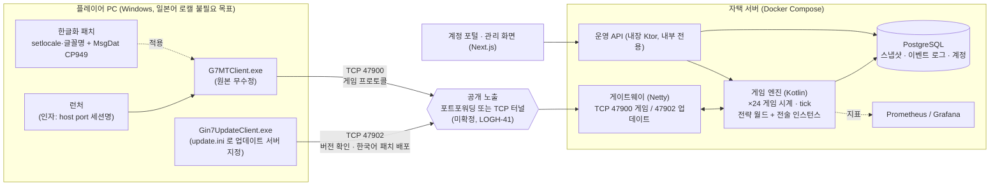
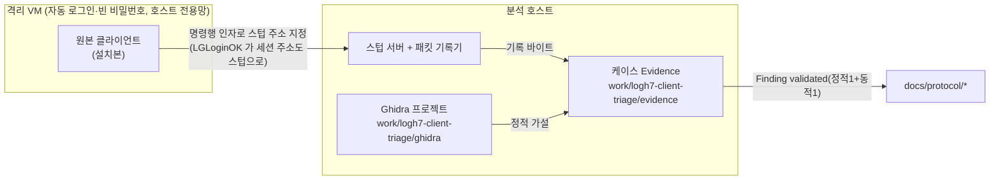

# 목표 구성도

## 1. 전체 구성 (목표 상태)

```mermaid
flowchart LR
  subgraph Player["플레이어 PC (Windows, 일본어 로캘 불필요 목표)"]
    LA["런처<br/>(인자: host port 세션명)"] --> CL
    CL["G7MTClient.exe<br/>(원본 무수정)"]
    UPD["Gin7UpdateClient.exe<br/>(update.ini 로 업데이트 서버 지정)"]
    PATCH["한글화 패치<br/>setlocale·글꼴명 + MsgDat CP949"] -. 적용 .-> CL
  end

  subgraph Home["자택 서버 (Docker Compose)"]
    GW["게이트웨이 (Netty)<br/>TCP 47900 게임 / 47902 업데이트"]
    ENG["게임 엔진 (Kotlin)<br/>×24 게임 시계 · tick<br/>전략 월드 + 전술 인스턴스"]
    ADM["운영 API (내장 Ktor, 내부 전용)"]
    PG[("PostgreSQL<br/>스냅샷 · 이벤트 로그 · 계정")]
    MON["Prometheus / Grafana"]
    GW <--> ENG
    ENG --> PG
    ADM --> ENG
    ADM --> PG
    ENG -. 지표 .-> MON
  end

  WEB["계정 포털 · 관리 화면 (Next.js)"] --> ADM
  UPD -- "TCP 47902<br/>버전 확인 · 한국어 패치 배포" --> EXPOSE
  CL -- "TCP 47900<br/>게임 프로토콜" --> EXPOSE
  EXPOSE{{"공개 노출<br/>포트포워딩 또는 TCP 터널<br/>(미확정, LOGH-41)"}} --> GW
```

## 2. 분석 단계 구성 (P1~P2)

```mermaid
flowchart LR
  subgraph VM["격리 VM (자동 로그인·빈 비밀번호, 호스트 전용망)"]
    C2["원본 클라이언트<br/>(설치본)"]
  end
  subgraph Host["분석 호스트"]
    STUB["스텁 서버 + 패킷 기록기"]
    GH["Ghidra 프로젝트<br/>work/logh7-client-triage/ghidra"]
    CASE["케이스 Evidence<br/>work/logh7-client-triage/evidence"]
  end
  C2 -- "명령행 인자로 스텁 주소 지정<br/>(LGLoginOK 가 세션 주소도 스텁으로)" --> STUB
  STUB -- "기록 바이트" --> CASE
  GH -- "정적 가설" --> CASE
  CASE -- "Finding validated(정적1+동적1)" --> SPEC["docs/protocol/*"]
```

주의: 클라이언트 안에 서버 계산이 얼마나 들어 있는지(전술 시뮬레이션의 클라이언트/서버 분담)는 아직 확인되지 않았다 `evidence:guess`. P2 트래픽 기록 후 이 그림을 갱신한다.

