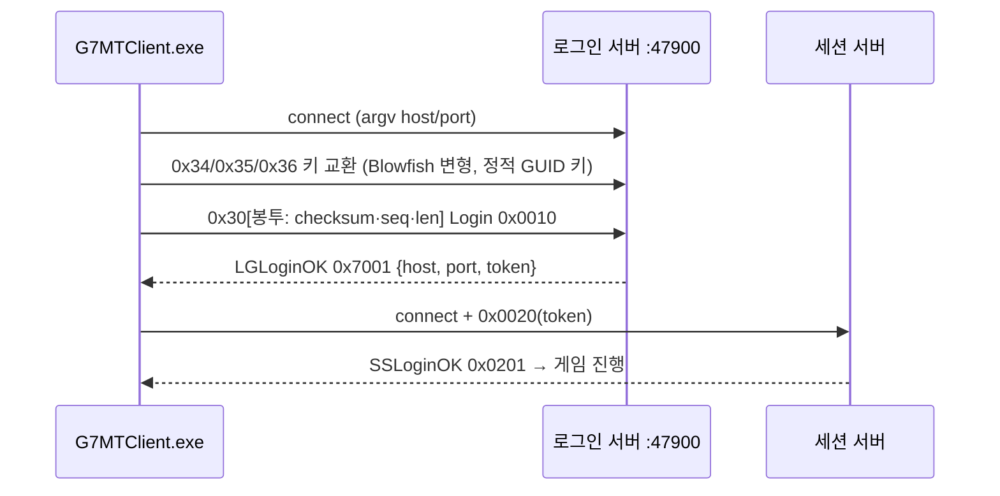

# LOGH7 클라이언트 오프라인 트리아지 보고서

## 1. 개요

- 목적: 서비스 종료된 『銀河英雄伝説VII』 원본 클라이언트에 붙는 대체 서버·한국어화를 위해, 원본 확보·설치본 추출·접속 흐름·프로토콜·텍스트 경로를 **정적으로** 파악한다.
- 결론 요약:
  1. 원본 CD 이미지와 공식 추가 데이터 업데이트를 확보해 해시 검증·전량 추출했다(실패 0).
  2. 클라이언트는 **명령행 인자로 로그인 서버를 지정**할 수 있고, 세션 서버 주소는 **로그인 응답(0x7001)이 결정**한다 → 클라이언트 무수정 접속이 가능하다.
  3. 통신은 **MultiTerm MPS** 미들웨어이며 **Blowfish 변형 + 키 교환 + 체크섬/시퀀스 봉투**로 암호화된다 → 대체 서버의 첫 병목.
  4. 게임 텍스트의 약 98%가 외부 `MsgDat`(HFWR)에 있고, 문자 변환이 한 함수에 모여 있어 한국어화 비용이 낮을 것으로 보인다.
  5. 자기검증·패커·안티디버그가 없어 패치가 가능하다.
- 한계: **동적 관찰이 없다**(격리 실행 환경 미준비). 원본 무결성 외의 Finding은 모두 `candidate`.

## 2. Scope 요약 (work/logh7-client-triage/scope.md)

| 항목 | 값 |
|---|---|
| auth | granted, basis = own_system (preset offline-sample, 사용자 소유 오프라인 복제본) |
| network_profile | offline (대상에 대한 네트워크 행위 없음. 공개 보관본 다운로드만) |
| in_scope | `Logh7.bin`, ISO 내용, InstallShield 추출 클라이언트 |
| activities | static_reverse, extraction, documentation |
| PRIMARY | ghidra-reverse (R22), 보조 protocol-reverse(R21)·thick-client(R32) |
| 역할 | lead = 메인, cre = 트랙 B 서브에이전트(정적 RE), doc = 메인 |

## 3. Evidence

| ID | 요약 | 종류 | 재현 |
|---|---|---|---|
| E-001 | archive.org 원본 MD5/SHA1 = `logh-7_files.xml` | file | `Get-FileHash` |
| E-002 | MODE2/2352 → ISO9660 97,394 섹터, sync 오류 0 | command | `tools/bin2iso.py` |
| E-003 | InstallShield 7, 2,219 항목, 실패 0 | command | `tools/isextract.py` |
| E-004 | G7MTClient x86 VC6/MFC, WS2_32 원시 TCP | command | `tools/petriage.py` |
| E-005 | 기본값 `202.8.80.179`/`47900`/`ginei00` 문자열 | file | 오프셋 0x36ee3c |
| E-006 | 업데이터 `:47902`, `SERVER.INI` 키 | file | 오프셋 0x4a540 |
| E-007 | G7UPD040514 Wayback digest 일치, SFX 레코드 9 | file | `tools/is_sfx_extract.py` |
| E-008 | G7UPD040514 = 추가 데이터 250개, exe 변경 없음 | command | 해시 비교 |
| E-010 | 4개 PE 인벤토리(VC6/MFC, 패커 없음) | command | `scripts/pe_inventory.py` |
| E-011 | 클라이언트 명령행 인자와 기본값 테이블 `0x0076ee04` | command | Ghidra export |
| E-012 | 업데이터 `update.ini [UPDATE]`, STARTUP_APPNAME 실행(인자 없음) | command | Ghidra export |
| E-013 | BootFirst 자기 갱신·업데이터 실행 루프 | command | Ghidra export |
| E-014 | TCP, gethostbyname→inet_addr, `[u16 BE len][payload]`, 최대 0xF000 | command | Ghidra export |
| E-015 | Blowfish 변형(π+1, XOR 0x91, LE, ECB) | command | `scripts/bf_verify.py` |
| E-016 | 봉투·키 교환 0x34/0x35/0x36, 0x30 데이터, 0x31 rekey | command | Ghidra export |
| E-017 | 메시지 ID 약 300개(디스패처 200 case + 이름표 15) | command | `scripts/dispatch_ids.py`, `msgname_tables.py` |
| E-018 | LGLoginOK(0x7001) → host/port/token → 0x0020 재접속 | command | Ghidra export |
| E-019 | MsgDat HFWR 21개 파싱 검증 | command | `scripts/hfwr_dump.py` |
| E-020 | setlocale("Japanese")+mbstowcs, UTF-16 글리프 캐시 | command | Ghidra export |
| E-021 | 텍스트 분량: exe UI ~191(4.9KB) vs MsgDat 4,833(248KB) | command | `scripts/ui_text_ratio.py` |
| E-022 | 패커·안티디버그·자기 체크섬 없음 | command | Ghidra/capstone |
| E-023 | 업데이터 0x6810~/0x8000~, HTTP 파일 전송 | command | Ghidra export |
| E-024 | 직렬화 BE 정수, NUL 문자열, 이름 u8+u16[] | command | Ghidra export |
| E-025 | 자산 시그니처(HFWR/GFWR/.tcf/.mdx/.mds/ViX 등) | command | `scripts/asset_sigs.py` |
| E-026 | (E-020 정정) 글꼴 face = ＭＳ ゴシック @0x0076e240 | file | — |
| E-027 | (E-025 정정) .tcf 배너 인코딩 | file | — |
| E-028 | 미들웨어 = MultiTerm MPS, argv[3] = 세션 서버 이름 | command | robot usage 문자열 0x0076be64 |

원문 발췌와 해시는 케이스 `evidence/E-*.md`(git 제외)에 있다.

## 4. Findings

### F-001 원본 무결성과 설치본 완전 추출
- category: other
- severity: n/a_re
- status: validated
- confidence: high
- evidence_ids: [E-001, E-002, E-003]
- location: `E:\logh7-original\archive\Logh7.bin` → `extracted\install\`
- impact: 이후 분석·서버 호환의 기준 클라이언트(버전 131) 확정. 과거 "추출 누락" 우려에 대해 항목별 MD5로 누락 0을 확인(invalid 10은 설치 미디어 자리표시자).
- repro: `tools\fetch-original.ps1`

### F-002 클라이언트 무수정 접속 경로
- category: design
- severity: n/a_re
- status: candidate
- confidence: high
- confidence_note: high(정적)
- evidence_ids: [E-005, E-011, E-012, E-014, E-018, E-028]
- location: 기본값 테이블 `0x0076ee04`, 로그인 응답 처리 `FUN_004ac700`
- impact: `G7MTClient.exe <host> <port> <세션명> …` 로 로그인 서버를 지정하고, 서버가 LGLoginOK에서 세션 서버 주소를 돌려주면 클라이언트 수정 없이 접속할 수 있다. IP 리터럴이라 hosts 파일은 무효.
- 승격 조건: 격리 VM에서 인자 실행 → 스텁 도달(LOGH-20)

### F-003 MPS 암호 계층
- category: reverse_algo
- severity: n/a_re
- status: candidate
- confidence: high
- confidence_note: high(구조) / medium(필드 배치)
- evidence_ids: [E-014, E-015, E-016, E-024, E-028]
- location: `mpsCipherManager::encipher/decipher_message`(`FUN_00645ce0`/`FUN_00645db0`), 키 교환 `0x00645180~0x006457e8`, 핸드셰이크 키 `0x0076bbf0`
- impact: 대체 서버가 Blowfish 변형·키 교환·봉투를 바이트 호환으로 구현해야 로그인 가능(LOGH-61).

### F-004 메시지 체계
- category: reverse_algo
- severity: n/a_re
- status: candidate
- confidence: high
- confidence_note: high(S→C 디스패처) / medium(C→S 이름표)
- evidence_ids: [E-017, E-018, E-024]
- location: 디스패처 `FUN_004ba2b0`, 이름 테이블 15개
- impact: opcode = `그룹<<8 | 인덱스`, 로그인 0x0010/0x7001/0x7002, 세션 0x02xx, 정보 0x03xx, 커맨드 0x04xx…, 로비 0x20xx. 미구현 후보 9건의 클라이언트 흔적 확인에도 사용.

### F-005 텍스트 경로와 한국어화 비용
- category: design
- severity: n/a_re
- status: candidate
- confidence: high
- confidence_note: high(구조) / guess(한글 동작)
- evidence_ids: [E-019, E-020, E-021, E-026]
- location: MsgDat 로더 `FUN_00522060`, 변환 `FUN_004eac60`, 글꼴 `FUN_004b07c0`, 글리프 캐시 `FUN_004b0960`
- impact: 텍스트 98%가 외부 파일, 변환 1곳, 글꼴 charset DEFAULT → 로캘 문자열·글꼴명 패치 + MsgDat CP949 재작성으로 한글 표시 가능성(ADR-0004, LOGH-36).

### F-006 패치 가능성
- category: other
- severity: n/a_re
- status: candidate
- confidence: high
- evidence_ids: [E-010, E-022]
- location: G7MTClient.exe 전체(IsDebuggerPresent는 D3DX assert 헬퍼 내부뿐)
- impact: 자기검증·패커·안티디버그 없음 → 주소·로캘·글꼴 문자열 패치와 DLL 후킹 모두 가능.

### F-007 업데이트 서버 프로토콜
- category: reverse_algo
- severity: n/a_re
- status: candidate
- confidence: medium
- evidence_ids: [E-012, E-013, E-023]
- location: Gin7UpdateClient.exe `FUN_0041ea60`/`FUN_0041e910`, BootFirst.exe
- impact: 제어 메시지 평문(0x6810→0x80xx), 파일은 HTTP Range. 스텁 → 한국어 패치 배포 채널로 재사용 가능(ADR-0002 결정 4).

### F-008 보존된 클라이언트 판본의 한계
- category: other
- severity: n/a_re
- status: validated
- confidence: high
- evidence_ids: [E-007, E-008]
- location: E:\logh7-originalrchive\G7UPD040514.exe
- impact: 공식 추가 데이터(2004-05-14)는 텍스처·모델뿐. 버전 131 이후 exe 갱신분은 보존되지 않았을 가능성이 높아, 패치로 추가된 기능 UI가 클라이언트에 없을 수 있다(리스크 R-02).

## 5. Paths

### P-001 접속 호출 흐름
- title: 접속 호출 흐름
- path_type: callflow
- start: 사용자 실행 · goal: 세션 서버 로그인
- steps:
  1. BootFirst 가 업데이터 자기 갱신 후 실행 — evidence: E-013 — finding: none
  2. 업데이터가 `update.ini`(기본 `202.8.80.179:47902`)로 버전 확인, 인자 없이 클라이언트 실행 — evidence: E-012, E-023 — finding: F-007
  3. 클라이언트가 인자 또는 기본값으로 로그인 서버(47900) 접속, `[u16 len][type]` 프레임 — evidence: E-011, E-014, E-028 — finding: F-002
  4. 키 교환 0x34/0x35/0x36(정적 GUID 키) 후 0x30 암호 메시지로 Login(0x0010) — evidence: E-015, E-016 — finding: F-003
  5. LGLoginOK(0x7001)가 세션 서버 host/port/token 전달 → 재접속 후 0x0020 — evidence: E-018 — finding: F-002, F-004
- residual_risks: 봉투 필드 배치·키 교환 blob·0x7001 오프셋은 동적 확인 필요.

### P-002 텍스트 렌더 흐름
- title: 텍스트 렌더 흐름
- path_type: callflow
- start: MsgDat 로드
- goal: 화면 글리프 출력
- steps:
1. MsgDat HFWR 로드(`FUN_00522060`) — E-019 — F-005
2. `setlocale(LC_CTYPE,"Japanese")` + `mbstowcs`(`FUN_004eac60`) — E-020 — F-005
3. 글리프 캐시(UTF-16 키, `FUN_004b0960`) 미스 시 `CreateFontA(DEFAULT_CHARSET,"ＭＳ ゴシック")` + `ExtTextOutA` 로 그려 D3D 텍스처 — E-020, E-026 — F-005
- residual_risks: 한글 글리프·줄바꿈·IME 동작은 PoC 필요.

### P-003 원본 복원
- title: 원본 복원
- path_type: solve
- start: archive.org 보관본
- goal: 검증된 설치본 트리
- steps:
1. archive.org 다운로드·해시 대조 — E-001
2. MODE2/2352 → ISO — E-002
3. ISO → InstallShield 7 캐비닛 → 항목별 MD5 — E-003 — F-001
4. Wayback 추가 데이터 확보·해체·비교 — E-007, E-008 — F-008

## 6. Timeline 요약

| 시각(KST) | 단계 | 결과 |
|---|---|---|
| 14:42 | master-route ×3, case-init(offline-sample), case-guard | PRIMARY R22, ready_for_act |
| 14:43–14:47 | 원본 확보·ISO·IS7 추출 | E-001~E-003 |
| 14:48 | PE 트리아지 | E-004~E-006 → 트랙 B 인계 |
| 14:48–15:33 | 트랙 B Ghidra headless 정적 분석 | E-010~E-028, docs/re·protocol·l10n |
| 15:30 | 공식 추가 데이터 확보(사용자 승인)·해체 | E-007, E-008 |

## 7. 다음 단계

- LOGH-5 격리 VM → LOGH-20 인자 실행 → LOGH-61 암호 계층 구현 → LOGH-22 프레이밍 validated → 로그인·캐릭터 생성(P2)
- LOGH-36 한글 표시 PoC, LOGH-12 MsgDat 왕복 도구
