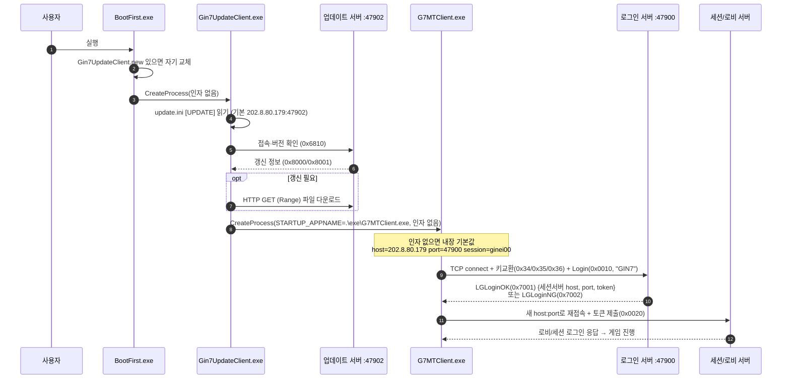

# 접속 흐름 (트랙 B)

- 작성자: 최병호
- 작성일: 2026-09-27
- 근거: Evidence E-011, E-012, E-013, E-014, E-018. 태그 `evidence:client`(관찰) / `evidence:guess`(추정), 신뢰도 high/medium/low.

## 1. 실행 순서

```
사용자 → BootFirst.exe
           ├─ .\Gin7UpdateClient.new 존재 시 .exe↔.old↔.new 교체 (자기 갱신)
           └─ CreateProcessA(".\Gin7UpdateClient.exe", 인자없음) → 대기
                 Gin7UpdateClient.exe
                   ├─ update.ini [UPDATE] 읽기 (VERSION, SERVER_ADDRESS=202.8.80.179, SERVER_PORT=47902 ...)
                   ├─ 업데이트 서버(47902)에 접속하여 버전 확인·파일 다운로드(HTTP)
                   └─ 완료 후 STARTUP_APPNAME(기본 .\exe\G7MTClient.exe)을 CreateProcessA로 실행 (WORK_DIR에서)
                         G7MTClient.exe
                           ├─ 명령행 인자 또는 하드코딩 기본값으로 로그인 서버 주소/포트/계정 결정
                           ├─ 로그인 서버(기본 47900)에 접속 → 인증
                           └─ LGLoginOK가 준 세션/로비 서버 주소로 재접속하여 게임 진행
```

- CD의 `G7Start.exe`는 **설치·런처 메뉴**로, 이 실행 체인과 분리되어 있다(설치/제거/PDF/DirectX). 게임 실행 시에는 관여하지 않는다. `evidence:client`, high.

## 2. 서버 주소·포트를 정하는 곳

| 프로세스 | 소스 | 기본값 | 근거 |
|---|---|---|---|
| G7MTClient.exe | 명령행 인자 `argv[1]=host argv[2]=port argv[3]=세션 서버 이름 argv[4]=수치 argv[5]=문자열(기본 dummy)`. 비면 내장 기본값 사용. **argv[3]은 계정이 아니라 MPS 세션 서버 이름**(robot usage 문자열, E-028이 E-011 정정) | host `202.8.80.179`, port `47900`, session `ginei00`, argv4 `1`, argv5 `dummy` (포인터 테이블 `0x0076ee04`) | E-011, E-028, `evidence:client`, high(argv1~3) / candidate(argv4~5 의미) |
| G7MTClient.exe | 로그인 성공 응답(LGLoginOK, 0x7001)이 다음 접속용 host(문자열)·port(u16)·token을 내려줌 | 서버가 지정 | E-018, host/port 위치는 high, 정확한 바이트 오프셋은 candidate |
| Gin7UpdateClient.exe | `update.ini` 파일의 `[UPDATE]` 섹션 (`GetPrivateProfileString/Int`) | `SERVER_ADDRESS=202.8.80.179`, `SERVER_PORT=47902` (문자열 폴백) | E-012, `evidence:client`, high |
| Gin7UpdateClient.exe | `%sSERVER.INI`(BASE_DIR 기준)의 `TYPE=1` 섹션 `ADDR`/`PORT` 목록 | 파일 없으면 무시 | E-012, `evidence:client`. 용도(서버 목록/폴백)는 미해결 |
| G7Start.exe | `HKLM\SOFTWARE\BOTHTEC\銀河英雄伝説VII\1.0` `Install`(설치 경로) | — | E-011 관련, 설치 확인용, 네트워크와 무관 |

- 실제 `ROOT\update.ini`에는 `[UPDATE] VERSION=131`만 있고 `SERVER_ADDRESS`가 없어, 업데이터는 내장 기본값 `202.8.80.179:47902`를 쓴다. `evidence:client`, high.
- 클라이언트는 업데이터로부터 인자를 **전달받지 않는다**. 업데이터의 `CreateProcessA`는 `STARTUP_APPNAME`만 넘기고 명령행 인자를 붙이지 않으므로(`0x00407260` 디스어셈블), G7MTClient는 인자 없이 실행되어 **내장 기본값**으로 접속한다. E-011/E-012, `evidence:client`, high. → 원래 서비스에서는 로그인 정보를 다른 방법(로그인 화면 입력, 또는 외부 런처가 인자 부여)으로 채웠을 가능성이 있다. `evidence:guess`.

## 3. 프로토콜 포트 구분

| 포트 | 프로세스 | 프로토콜 | 근거 |
|---|---|---|---|
| 47902 | Gin7UpdateClient.exe | 업데이트(자체 메시지 0x68xx/0x80xx) + 파일 다운로드는 HTTP | E-023, `evidence:client` |
| 47900 | G7MTClient.exe | 게임/로그인(암호화된 mps 메시지). 로그인 서버·세션 서버·로비 서버가 프로토콜 버전이 각각 다르며(배너 문자열 `session/lobby/login-server protocol version`), 접속 대상은 로그인 응답으로 바뀜 | E-014/E-016/E-018, `evidence:client` |

## 4. 대체 서버 가로채기 지점 비교

목표: 원본 G7MTClient.exe가 우리 서버에 붙게 만들기.

| 방법 | 구현 | 장점 | 단점 | 평가 |
|---|---|---|---|---|
| A. 명령행 인자 | `G7MTClient.exe 127.0.0.1 47900 <세션명> 1 dummy` 로 직접 실행(BootFirst/Updater 우회) | 바이너리 무수정, 즉시 가능, host/port/세션명이 인자로 열려 있음 (E-011, E-028) | 로그인 성공 후 서버가 세션 서버 주소를 내려주므로, **우리 서버가 LGLoginOK에서 127.0.0.1을 반환**해야 완결됨(주소 리다이렉트는 서버 몫) | **권장 1순위.** 클라이언트 수정 0 |
| B. update.ini + STARTUP 인자화 불가 | 업데이터가 인자를 안 붙이므로 update.ini만으로는 게임 서버를 못 바꿈 | — | 업데이터 경로로는 게임 포트 제어 불가 | 게임 접속엔 부적합(업데이트 서버만 바뀜) |
| C. hosts / loopback DNS | `202.8.80.179`를 hosts로 127.0.0.1에 매핑 | 바이너리·인자 무수정, BootFirst 체인 그대로 사용 가능 | `202.8.80.179`는 `gethostbyname` 실패 후 `inet_addr`로 처리되는 IP 리터럴이라 **hosts가 안 먹음**(E-014: gethostbyname→실패→inet_addr). 라우팅 리다이렉트(방화벽 NAT)가 필요 | 리터럴 IP라 DNS 불가, NAT 필요 → 차선 |
| D. 문자열 패치 | `.data`의 `202.8.80.179`(0x0076ee3c)를 `127.0.0.1\0`로, 필요 시 포트도 패치 | 인자·환경 무관하게 항상 우리 서버로 | 바이너리 수정 필요(체크섬 검사는 없어 가능, E-022). 세션 서버 주소는 여전히 서버 응답이 결정 | B안 대비 안정적. 배포 편의용 |
| E. connect 후킹 | `connect`/`gethostbyname` IAT 후킹 DLL 주입 | 모든 접속을 통째로 리다이렉트 | 별도 로더/DLL 필요, 동적 기법 | 다른 방법으로 충분하면 불필요 |

- **결론**: 우리가 서버를 새로 만드는 상황이므로, **A(명령행 인자로 host=우리서버) + 서버가 로그인 응답에서 세션/로비 주소를 우리서버로 반환**하는 조합이 최선. 클라이언트 무수정. 배포용으로는 D(문자열 패치)를 병행. `evidence:client` 기반, 최종 선택의 실효성은 동적 확인 전까지 candidate.
- 주의: 접속 성립 후에도 **핸드셰이크 암호(0x34/0x35/0x36)와 메시지 암호(Blowfish 변형)를 서버가 그대로 구현**해야 로그인까지 도달한다(프로토콜 문서 참조). 가로채기 지점 선택과 무관하게 이 부분이 실제 병목.

## 5. 시퀀스 다이어그램



## 6. 미해결

- 업데이터가 클라이언트에 로그인 정보를 넘기지 않는데, 원 서비스에서 계정/비밀번호가 어떻게 채워졌는지(전용 런처? 로그인 다이얼로그?) — 정적으로는 로그인 GUI 입력 경로(`0x2216bd2` 계정, `0x2216c3c` 수치)만 확인. `evidence:guess`.
- `SERVER.INI`의 `TYPE/ADDR/PORT` 목록이 게임 서버 목록인지 업데이트용인지. 업데이터 코드에만 있어 업데이트 관련으로 추정. candidate.
