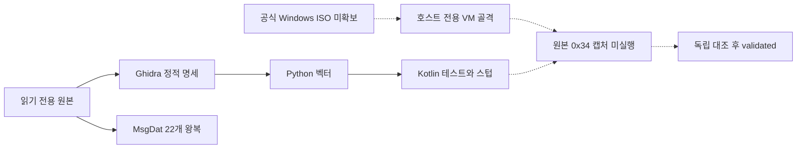

# LOGH7 부활 세션 2 보고서

> **후속 실행:** 아래 본문은 ISO 미확보 당시의 세션 2 점검 기록이다. 이후 Windows·게임 설치와 파일 비교를 완료하고, 오디오 초기화 정지 원인을 찾아 원본 첫 `0x34`를 확보했다. 현재 판정은 [기동·캡처 보고서](2026-09-28-audio-startup-report.md)에 있다. `evidence:client` (동적 케이스 E-103~122).

작성: 최병호 · 실제 실행일: 2026-09-27(KST) · 파일명은 사용자 지정 세션 식별자를 유지한다.

Kotlin 서버 골격과 정적 암호 벡터 테스트, MsgDat 22개 왕복, 패치 이력·매뉴얼 표 검증을 완료했다. 사라진 G: 때문에 막혔던 VirtualBox는 사용자 추가 승인으로 `E:\VirtualBox`에 재설치했고 Windows VM 골격을 만들었다. 공식 Windows ISO는 다운로드 요청이 거부되어 확보하지 못했다. **원본 클라이언트의 첫 0x34 캡처와 프레이밍 validated 승격은 미달성**이다. `evidence:client` (E-101·E-102·E-300~304·E-400~402), 서버 구현은 `evidence:guess`.

## 1. 가정과 사용자 확정

- C#/.NET 숙련 여부를 한 번 질문했고 사용자가 "아니요 — Kotlin으로 진행"이라고 답했다. D-5를 유지한다. `evidence:guess`
- 별도 세션 요청에 따라 **프로젝트 채팅 5개**를 실제 생성했다. §D 공통 머리말·트랙 프롬프트를 그대로 전달하고 소유권·현재 장애를 추가했다. 리드는 T0·Git·Linear·통합을 병행했다. [채팅 ID와 배정](2026-09-28-orchestration.md). `evidence:guess`
- G:는 현재 연결된 디스크에 없었다. 사용자는 재설치와 전용 경로 `E:\VirtualBox`를 승인했다. 이는 `E:\Tools` 규칙의 VirtualBox 한정 예외다. 기존 Ubuntu와 원본 게임 파일을 보존했다. `evidence:client`
- 문서의 도구 버전은 각 트랙에서 공식 배포를 재확인했다. 게임 서버는 Spring 없이 Kotlin/JVM·Netty·코루틴·내장 Ktor, 웹 Next.js, 플레이어용 도구 Rust 우선이다. Python 사본 패처는 정적 PoC 도구다. `evidence:guess`
- GCP는 설계 전제이며 생성·apply·과금·공개 배포는 하지 않았다. 서울 비용표는 SKU 확정 전 예산 범위이고 공식 견적이 아니다. `evidence:guess`

## 2. 완료한 것: 읽음과 실행함

### 읽음

AGENTS.md, next-session-orchestration.md의 A~D, BOOTSTRAP-REPORT.md, PLAN.md, ADR-0001~0005, protocol-draft.md, connection-flow.md, text-format.md를 읽었다. reverse-skill은 AGENTS.md → RULES.md → MASTER-ROUTING.md, tool-index, 기존 field-journal, thick-client·case-review·docs-generator·diagram-generator와 관련 근거 계약·익명화 규칙을 읽었다. Linear LOGH 사이클 1·2와 변경 대상 이슈·P6를 실제 조회했다. 읽었다는 사실만으로 분석·설치를 실행했다고 보고하지 않는다.

### 실행함

| 트랙 | 실행과 산출물 | 검증·한계 |
|---|---|---|
| T0 | Linear 결정 정정, VirtualBox 7.2.20 재설치, logh7-win 생성, 통합·검증·Git | VM OS와 게임 설치는 미실행. [격리 환경](../ops/isolation-vm.md) |
| T1 | Gradle 6개 모듈, 제한된 YAML→opcode 코덱 골격, 암호·봉투·키 교환 상태 골격, 47900/47902 스텁, Ktor | 전체 build 성공, JUnit 13개 실패 0, 정적 벡터 22건. loopback 및 실제 host-only IP 바인딩·합성 TCP·방향별 binary 캡처 확인. [서버 메모](../protocol/server-notes.md) |
| T2 | 키 교환·로그인·업데이터·지도 명세, 독립 Python 벡터 생성, E-300~304 | P/S 1,042워드 대조, 암복호 왕복 9건, strict 해시 검토 PASS. 전부 candidate. [봉투](../protocol/kex-envelope.md), [로그인](../protocol/login-messages.md), [업데이터](../protocol/update-protocol.md), [지도](../re/galaxy-map.md) |
| T3 | HFWR/GFWR 도구·토큰 보호·원본 불변 사본 패치, 용어집 | 22/22 SHA256 동일을 리드가 재실행. 단위 테스트 7개 PASS. 실제 한글 화면 미검증. [도구](../../tools/l10n/README.md), [용어집](../l10n/glossary.md) |
| T4 | 지정 패치 URL 33개 열람→고유 공지 18건 요약, p.56–100 이미지 대조, CSV 보정 | 카드 75행, 배치/생산 334행, 함선 118행. 원문 전재 없음. p.92 이름 2개는 원본 잘림 상태 유지. [패치 이력](../manual/09-patch-history.md), [검증 범위](../manual/08-organization-units-data.md) |
| T5 | Compose·IaC·백업·비용 문서, Ubuntu 복제본 리허설 | PostgreSQL·Prometheus·Grafana 기동, stop/start·VM 재부팅 후 자동 기동·DB 표식 유지 PASS. [리허설 기록](../ops/rehearsal-2026-09-27.md). 실제 게임 이미지·백업 복원·50명 부하는 별도 |

관찰·정적 해석은 `evidence:client`, 매뉴얼 대조는 `evidence:manual`, 새 서버/운영 구현은 `evidence:guess`다.

주요 정정: phase4 시작은 `0x00645a80`; 로그인 송신은 `0x7000`; 응용 헤더는 방향별 비대칭; float32는 BE 비트패턴; 업데이터 0x80xx는 오류 본문 값이며 업데이트 없음 후보 교환은 6810→6811, 6820→6822다. 기존 초안·ADR-0002·접속 흐름에 최신 명세 우선 안내를 넣었다. `evidence:client` (E-300~304).

### 완료 조건 판정

| 목표 | 판정 | 근거와 남은 일 |
|---|---|---|
| G-1 D-1~D-5 | 달성 | ADR·용어집·AGENTS와 Linear 반영. [변경 기록](2026-09-28-linear-updates.md) |
| G-2 서버 골격·CI | 달성 | 로컬 빌드 + [GitHub Actions 성공](https://github.com/peppone-choi/logh7/actions/runs/36303360614) |
| G-3 암호 벡터·상태 골격 | 달성 | 클라이언트 테이블 정적 벡터 테스트 통과. 실제 키 교환 완료를 뜻하지 않음 |
| G-4 Windows VM·실설치 | 부분 | 하이퍼바이저·VM 골격 완료, ISO 부재로 OS·자동 로그인·ja-JP·설치 비교 미완료 |
| G-5 첫 0x34·validated | 미달성 | 실제 원본 캡처 없음. 합성 테스트를 독립 동적 근거로 승격하지 않음 |
| G-6 22개 왕복 | 달성 | SHA256 22/22 동일, 원본 불변 |
| G-7 패치·CSV 대조 | 달성(원자료 한계 명시) | 지정 33 URL·p.56–100 대조. 이후 패치 전체·잘린 이름은 추가 조사 |
| G-8 로컬 리허설·IaC·비용 | 달성(초안 범위) | Ubuntu 복제본 기동·재시작·VM 재부팅 PASS, IaC 적용 안 함, 비용은 출처·가정 포함 범위 추정 |
| G-9 보고·PR·Linear·기록 | 산출·검증 완료, 병합 상태는 PR 참조 | [통합 PR #5](https://github.com/peppone-choi/logh7/pull/5), Linear 갱신·로컬 journal 커밋 완료 |

## 3. 못 한 것과 이유·필요 조치

| 항목 | 이유 | 다음 조치 |
|---|---|---|
| Windows OS·게임 설치·첫 패킷 | 공식 다운로드 링크 API가 SentinelReject, Windows 브라우저는 미디어 생성 도구로 이동 | Microsoft 공식 x64 ISO를 E:에 확보·해시 검증 후 기존 logh7-win에 설치 |
| 자동 로그인·빈 비밀번호·ja-JP·clean/installed | OS 설치 전 단계 | ISO 확보 후 게스트 설정. 사용자 로그인/암호 질문 없음 |
| 프레이밍 validated·키 교환 상호운용 | 원본 실행 증거 없음 | 첫 0x34 캡처→복호·checksum→0x35/0x36 교환 확인 |
| 한글 화면·IME 왕복 | VM OS 없음 | 패치 사본으로 표시·토큰·줄바꿈·IME를 검증 |
| 원본 전체 지도값 | 수신 형식은 찾았지만 서버 좌표 데이터 소실 | 매뉴얼 시드와 합성 표시 실험, 추정값 별도 관리 |
| p.92 기함 이름 2개 | 원본 PDF 자체 잘림 | 다른 판본/공식 근거 확인, 현재 name_clipped 유지 |
| 2004-09 이후 전체 패치·점검 공지 전체 | 지정 33 URL은 중복 캡처 포함 | 다른 캡처·update.cgi 후속 조사 |
| 나무위키 현행 표기 재조회 | 웹 접근 실패 | 기존 조사 승계 표시 유지, 페이지 재열람 후 갱신 |
| 실제 서버 Compose·백업 복원·50명 부하·Terraform plan | 이번 서버는 골격, 운영 설계는 초안 | 실제 이미지·WAL·복원 시험을 다음 운영 이슈로 진행 |

실행 장애와 설계 미확정은 구분해 기록했으며 외부 스캔·GCP 과금·원본 게임 파일 변경은 하지 않았다.

ops 채팅에서 자체 생성한 `docs/ops/vm-temporary.png` 삭제가 자동 승인 검토의 `blocked by policy`로 거부됐다. 우회 삭제하지 않고 로컬에 보존하며 `docs/ops/.gitignore`로 커밋에서 제외했다. 두 Ubuntu VM은 리허설 후 저장 상태로 돌아갔고 실행 중 VM은 없다. Windows VM은 전원 꺼짐 상태다.

## 4. 리스크 3개와 다음 세션 첫 작업 3개

| 리스크 | 영향 |
|---|---|
| Windows ISO 확보와 DirectX 호환성 | 원본 실행 검증의 선행조건. 3D 기동 실패 시 사용자가 지정한 대안 질문 절차 적용 |
| 정적 명세의 오판 가능성 | 이번에 opcode·헤더 오류가 정정됨. 합성 벡터 PASS만으로 클라이언트 호환을 보장할 수 없음 |
| 운영 골격과 실제 서비스의 간격 | 게임 이미지·계정·영속화·WAL 복원·부하 미검증. 공개 운영 가능 상태가 아님 |

1. 공식 Windows x64 ISO 확보 → 기존 logh7-win OS 설치·자동 로그인·ja-JP·호스트 전용망·clean.
2. 원본 설치 전후 파일/레지스트리 비교 → 첫 0x34 캡처 → 정적 암호·봉투와 독립 대조.
3. 0x35/0x36 및 로그인 0x7000/7001 실제 교환, 업데이트 스텁 수용과 한글 표시 PoC.

## 5. 사용자 미결

현재 필요한 외부 입력은 **Microsoft 공식 Windows 10 x64 ISO 확보 경로**다. C# 숙련·VirtualBox 사용·E: 설치 예외·GCP 전제·용어 기준·reverse-skill push 여부는 이미 결정되어 다시 묻지 않는다. 게스트 로그인/암호도 사용자에게 요구하지 않는다. GCP 생성·공개 운영은 별도 승인 범위다.

## 6. Evidence·검증·출처

분석 범위는 로컬 `work/logh7-client-triage/scope.md`(offline-sample), `work/l10n/scope.md`(오프라인), `work/logh7-dynamic-p2/scope.md`(own-system/lab_only)다. 게임 저작물·케이스 원자료는 Git 제외다.

| 근거 | 재현/보관 | 결론 연결 |
|---|---|---|
| E-101·102 | 동적 케이스 notes/vbox-restored.txt·windows10-download-rejected.json, Evidence에 SHA256 | F-100: VM 골격은 있고 ISO 미확보. P-100: 설치→캡처 재개 경로 |
| E-300~304 | 정적 케이스 Evidence·Ghidra export, generate_vectors.py | 정적 명세·테이블·지도 후보. 동적 미검증 |
| E-400~402 | l10n 케이스, msgdat.py roundtrip·patch·unittest | 파일 왕복·사본 패치. 실제 화면 미검증 |

리드 `review_case.py --verify-hashes --strict` 결과: 정적 케이스 **PASS(32 Evidence, 12 Finding, 4 Path)**, 동적 준비 **PASS(3 Evidence, 1 Finding, 1 Path)**, l10n **PASS(3 Evidence, 2 Finding, 1 Path)**. PASS는 증거 연결·구조·해시 무결성 판정이며 분석 완료나 게임 접속 성공 판정이 아니다. 타임라인·작업 항목은 각 케이스에 보존했다.

reverse-skill: field-journal·references·_index를 **로컬 main `b49d82b`**에만 커밋했고 push하지 않았다. tool-index 재생성도 실행했다. 새 라우팅 규칙·전역 하네스·자동 위임·자동 리뷰 루프는 추가하지 않았다. 익명화 스캔 0건.

흐름도는 위 Mermaid 원문으로 제공한다. render_diagram.py도 실행했으나 Mermaid CLI가 없어 SVG 렌더는 실패했다. 이미지 생성 성공으로 보고하지 않으며, 요청된 문서 다이어그램 원문은 보존했다.

- [Oracle VirtualBox 공식 배포](https://download.virtualbox.org/virtualbox/7.2.20/), [설치 조건](https://docs.oracle.com/en/virtualization/virtualbox/7.2/user/installation.html)
- [Microsoft ISO](https://www.microsoft.com/en-us/software-download/windows10ISO), [디스크 진단](https://learn.microsoft.com/en-us/troubleshoot/windows-server/backup-and-storage/troubleshoot-disk-management), [subst](https://learn.microsoft.com/en-us/windows-server/administration/windows-commands/subst)
- 서버 공식 버전·해시는 [서버 메모](../protocol/server-notes.md), 운영 공식 가격·한계는 [GCP 초안](../ops/adr-0005-gcp-draft.md).
- 매뉴얼 원본 `E:\manual-variants\internet-archive\gin7manual.pdf` p.56–100, Wayback 개별 URL은 [패치 이력](../manual/09-patch-history.md).
- Linear 계획 원천: [LOGH 팀](https://linear.app/peppone-choi/team/LOGH). 이 보고서는 실행 영수증이며 계획 원천을 대체하지 않는다.
