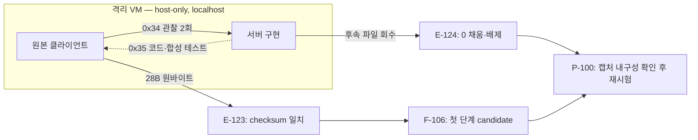

# LOGH7 세션 3 — 키 교환 구현과 동적 검증 중단

작성: 최병호 · 실행일: 2026-09-28(KST) · 판정: **첫 0x34 재현, 0x35~0x36·로그인 원본 상호운용 미검증**. 이번 보고서는 일반 역공학 보고서(`flavor = null`)이며, 원본 게임 바이트·화면·계정 값은 Git 제외 `work/`에만 둔다. `evidence:client`.

## 1. 가정과 범위

- 게임 클라이언트·설치본은 사용자 소유 격리 Windows VM에서만 실행하고, NIC1 host-only·NIC2 none, 스텁은 게스트 localhost에 한정했다. VM 명령은 헤드리스 CLI로만 실행했다. [동적 scope](../../work/logh7-dynamic-p2/scope.md), [정적 scope](../../work/logh7-client-triage/scope.md). `evidence:client`.
- 명령행 인자 `argv[3]`의 실제 게임 로그인 경로는 정적 분석상 0x7000의 첫 계정 문자열이다. 옛 robot usage의 “세션 서버 이름” 설명은 해당 경로에 적용하지 않는다. `argv[4]`는 세션 ID 후보, `argv[5]`는 인증 문자열 후보이며 동적 수용 전까지 candidate다. [세션 로그인 명세](../protocol/session-login.md), 정적 E-311. `evidence:client`.
- 사용자 정정에 따라 `server-core`, `re-deep`, `l10n`은 **별도 Codex 세션**으로 실행했고 리드가 이 세션에서 T0와 git·VM을 담당했다. 이 세션은 외부 다운로드·게임 VM NAT·호스트 방화벽 변경·원본 수정·GUI 자동화를 하지 않았다. `evidence:client`(작업 기록).

## 2. 완료 — 읽음과 실행함

**읽음:** `AGENTS.md`, 사용자 세션 3 지시, [오디오 기동 보고서](2026-09-28-audio-startup-report.md), [격리 VM 절차](../ops/isolation-vm.md), [키 교환](../protocol/kex-envelope.md), [로그인](../protocol/login-messages.md), [서버 메모](../protocol/server-notes.md), reverse-skill `AGENTS.md`→`RULES.md`→`MASTER-ROUTING.md`, `protocol-reverse`·`docs-generator`·`diagram-generator` 절차, Linear LOGH-18·19·22·23·24·36·61 및 상태 정리 대상 이슈를 확인했다. 읽기만 한 항목을 실행 결과로 세지 않았다. `evidence:client`.

**실행함:** `master-route`는 protocol-reverse R21을 선택했고 기존 동적 케이스 `case-guard`가 PASS했다. 오프라인 `session3-base` 스냅샷(UUID `8162f291-2b0f-44f4-9a87-4ee5d858f1e5`)을 만든 뒤 기존 실행 절차로 **독립 두 번째** 첫 `0x34`를 캡처했다. 파일 28바이트, SHA-256 `88f966d12c2c520cf84034e4e1d2daba1c91cc5adaeda8fea22517303641d91e`; A 키 길이 16, 초기 sequence 1, checksum `0x7abf` 재계산 일치, 0 패딩 없음. [E-123](../../work/logh7-dynamic-p2/evidence/E-123.md). `evidence:client`.

서버 세션은 B 역할의 0x34 검증·0x35 생성·0x36 검증, 방향별 0x30 봉투, 로그인 0x7000/0x7001/0x7002 및 재접속 0x0020 token 검증을 구현했다. 리드는 E: 캐시만 사용한 `gradlew build :app:installDist --offline --no-daemon`과 실제 새 `0x34` 한 건을 넣은 `:gateway:test --offline --rerun-tasks`를 통과했다. 초기 프레임 골든 테스트는 실행됐고 전체 교환 골든 테스트는 파일이 없어 skip됐다. 구현은 원본 호환 **후보**다. [서버 메모](../protocol/server-notes.md), [E-123](../../work/logh7-dynamic-p2/evidence/E-123.md). `evidence:client`(시험), `evidence:guess`(미검증 호환성).

정적 세션은 phase3·첫 0x7000·새 연결의 0x0020→0x2000·0x7002 표시 경로와 합성 벡터 21개를 기록했다. 모두 candidate이며 클라이언트 실행을 대신하지 않는다. [E-310~314](../../work/logh7-client-triage/report/t2deep-findings.md), [세션 로그인](../protocol/session-login.md). 한글 세션은 EXE·MsgDat **사본** PoC와 후보 40개, 토큰·구조·CP949 왕복 검사를 만들었다. 리드가 도구 단위 테스트 7개와 해당 케이스 strict PASS를 재확인했다. VM 화면 표시는 미검증이다. [한글 PoC](../l10n/poc-2026-09-28.md), [E-403~405](../../work/l10n/report/report.md). `evidence:client`.

| 목표 | 현재 판정 | 근거 |
|---|---|---|
| G-1 키 교환 validated | **미달성**: 0x34는 2회 확인, 실제 0x35/0x36 원바이트 없음 | E-119·120·123·124, `evidence:client` |
| G-2 독립 3세션·전체 골든 | **미달성**: 첫 0x34 2세션, 초기 프레임 골든만 통과 | E-119·123, JUnit XML, `evidence:client` |
| G-3 첫 0x30·0x7000 복호 | **미달성**: 정적 후보·합성 벡터만 | 정적 E-311·314, `evidence:client` |
| G-4 성공·실패 로그인 | **미달성**: 서버 합성 테스트만 | LOGH-23, `evidence:guess`(실동작) |
| G-5 재접속 다음 메시지 | **부분**: 정적 0x2000/2001/2006 후보, VM 응답 없음 | 정적 E-312, `evidence:client` |
| G-6 한글 1화면 | **부분**: 사본 PoC 완료, 스크린샷 없음 | l10n E-403~405, `evidence:client` |
| G-7 보고·Linear·strict·체크리스트 | **달성 범위**: 세 케이스 strict PASS, Linear 현재 상태 반영, reverse-skill 로컬 main 기록 | 아래 검증, `evidence:client` |

### 증거에서 결론으로

| Evidence | Finding | Path·현재 결정 |
|---|---|---|
| 동적 E-119·120·123: 독립 첫 0x34의 길이·checksum | F-106 `candidate` — 첫 프레임 형식 반복 일치 | P-100 `solve`: 완전한 0x35·0x36 원바이트 전에는 전체 키 교환 승격 금지 |
| 동적 E-124: Guest Control 정지, 회수 파일 모두 0 | F-107 `candidate` — 해당 파일은 교환 증거로 사용 불가 | P-100: VM·기록 내구성 분리 확인 뒤 단일 재시험 |
| 정적 E-310~314: phase3·로그인·로비 흐름 | F-310~313 `candidate` | P-310 `callflow`: 실제 VM 바이트와 대조할 체크리스트 |
| l10n E-403~405: 사본 패키지와 코드 위치 | F-403·404 `candidate` | P-403 `solve`: ja-JP 화면 관찰 후만 ADR-0004 채택 판단 |

## 3. 못 한 것, 이유와 필요한 조치

게스트에서 서버와 클라이언트 창을 띄웠지만 Guest Control 세션이 `VERR_DUPLICATE`·`VERR_TIMEOUT`으로 반복 정지했다. 강제 전원 종료 후 회수한 수신 28·116바이트, 송신 80바이트 파일은 **전부 0**이어서 0x35/0x36·0x30 증거에서 제외했다. 공유 캡처 폴더는 게스트 probe 쓰기만 확인됐고 다음 시험은 DBWIN 준비 단계에서 멈춰 클라이언트 패킷이 없었다. 원인은 아직 특정하지 않는다. 반복 종료 뒤 Windows 복구 화면이 나타나 더 이상의 동일 시험을 멈추고 `session3-base`로 복원했다. VM은 현재 poweroff, 임시 공유 매핑 없음, 호스트 47900~47903 LISTENING 0개다. [E-124](../../work/logh7-dynamic-p2/evidence/E-124.md), [실행 기록](../../work/logh7-dynamic-p2/notes/session3-vm-stall-2026-09-28.md). `evidence:client`.

다음 동적 시험 전 VM 부팅·Guest Additions·정상 종료와 게스트→호스트 기록의 **실제 내용/해시**를 게임 없이 확인해야 한다. 그 후 한 번의 키 교환만 수행하고 원바이트를 즉시 호스트에서 검증한다. 원본 수용이 확인되기 전 LOGH-61·22·23을 Done으로 옮기거나 ADR-0004를 채택하지 않는다. `evidence:guess`(다음 조치).

## 4. 리스크 3개와 다음 세션 첫 작업 3개

| 리스크 | 영향·대응 |
|---|---|
| VM/Guest Control 정지 | 캡처 손상·복구 화면 재발 가능. 기준 스냅샷 보존, VM 건전성부터 단일 시험. `evidence:client` E-124 |
| 합성 벡터의 과대 해석 | 서버 테스트 PASS가 원본 0x35 수용을 증명하지 않는다. 실제 원바이트 확보 전 candidate 유지. `evidence:client`/`evidence:guess` |
| 한글 렌더링 미확인 | CP949 사본은 파싱됐지만 ja-JP 화면 글리프는 미측정. VM 복구 후 PoC 사본에서만 확인. `evidence:client`/`evidence:guess` |

1. `session3-base`에서 OS·Guest Additions·정상 종료·호스트 기록 내구성을 **게임 없이** 검증한다. `evidence:guess`.
2. 한 번의 원본 키 교환을 기록하고 0x34/0x35/0x36·첫 0x30의 길이·checksum·SHA-256을 즉시 확인한다. 실패하면 재반복 전에 원인을 분리한다. `evidence:guess`.
3. 키 교환이 통과한 경우에만 3세션 골든과 로그인 성공·실패, 그다음 한글 PoC 화면을 순서대로 진행한다. `evidence:guess`.

## 5. 사용자 미결

현재 승인 범위 안에서 추가 입력이 필요한 항목은 없다. VirtualBox 복구 후에도 Guest Control이 불안정하면, 다음 세션에서 **다른 하이퍼바이저의 헤드리스 CLI로 전환할지** 별도 결정을 받아야 한다. 호스트 방화벽·어댑터 변경, 게임 VM NAT, 외부 다운로드, GCP 과금은 이번 세션에 하지 않았다. `evidence:client`(미실행), `evidence:guess`(대안).

## 6. 검증·출처

- 동적 케이스 `review_case.py --verify-hashes --strict`: Evidence 25·Finding 8·Path 1, 오류·경고 0. 정적 케이스: Evidence 39·Finding 16·Path 5, 오류·경고 0. l10n 케이스: Evidence 6·Finding 4·Path 2, 오류·경고 0. 세 케이스의 scope·timeline·workitems·report는 Git 제외 `work/`에 있다. `evidence:client`.
- [Linear LOGH-21](https://linear.app/peppone-choi/issue/LOGH-21/패킷-캡처-도구wiresharktsharknpcap-설치-여부-결정과-설치)는 스텁 기록기로 현 단계 충분해 Done, LOGH-26에는 오디오 출력 사전 점검과 `exe\` 작업 디렉터리 요구를 추가했다. LOGH-14·19·38·41·42·43은 남은 완료 조건에 따라 Todo, LOGH-18·22·23·36·61은 In Progress, LOGH-24는 Backlog로 두고 근거 댓글을 남겼다. `evidence:client`(Linear 조회·수정).
- reverse-skill의 보고서·다이어그램·field-journal·references·index 체크리스트를 적용했다. 경험 기록은 `E:\reverse-skill` **로컬 main** 커밋 `9df3560`이며 push하지 않았다. 공개 커뮤니티 기여는 이번 세션의 D-3 범위 밖이다. `evidence:client`.
- [Oracle VirtualBox 7.2.20 User Manual](https://download.virtualbox.org/virtualbox/7.2.20/UserManual.pdf): Guest Control·공유 폴더·`controlvm poweroff`의 데이터 손실 가능성 및 `shutdown`의 Guest Additions 요구. 특정 정지 원인에 관한 근거로 쓰지 않는다.
